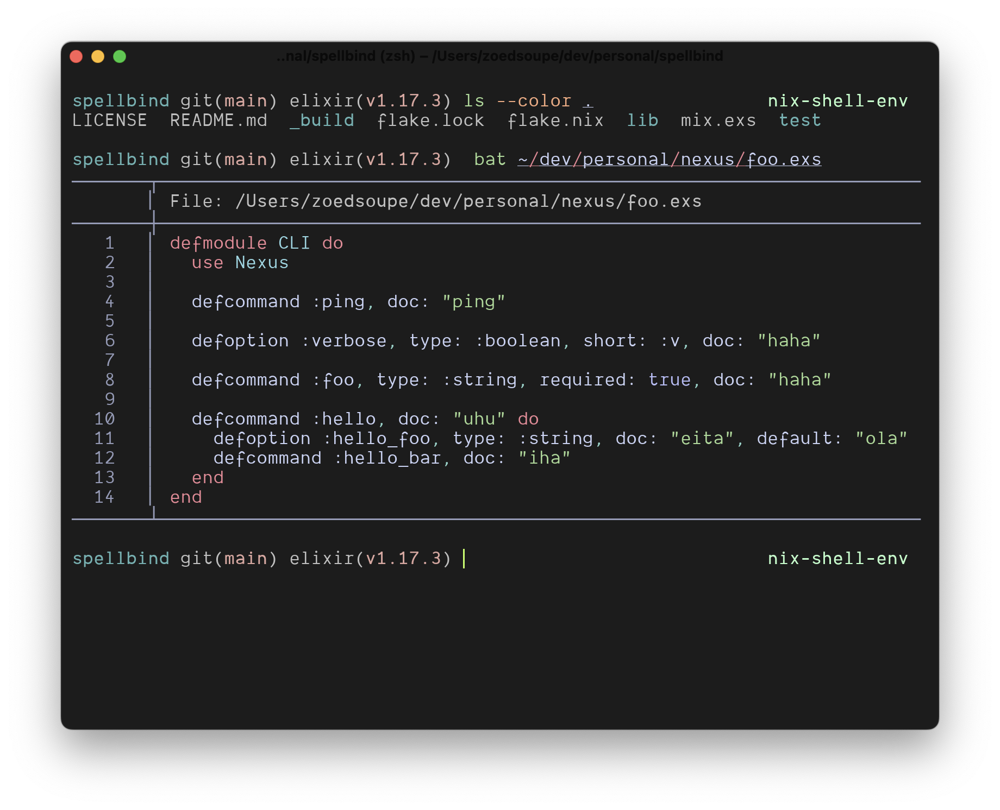

# darkvoid (rio)



## Configuration

place the `darkvoid.toml` file to your rio themes folder, generally `$XDG_CONFIG/rio/themes`.

then you can add this config to your rio config:

```toml
# $XDG_CONFIG/rio/config.toml
theme = "darkvoid"
```

be darky and happy (:

## Thanks

- [rio terminal](https://github.com/raphamorim/rio)
- [darkvoid.nvim](https://github.com/Aliqyan-21/darkvoid.nvim)

## License

darkvoid is licensed under the MIT License.
